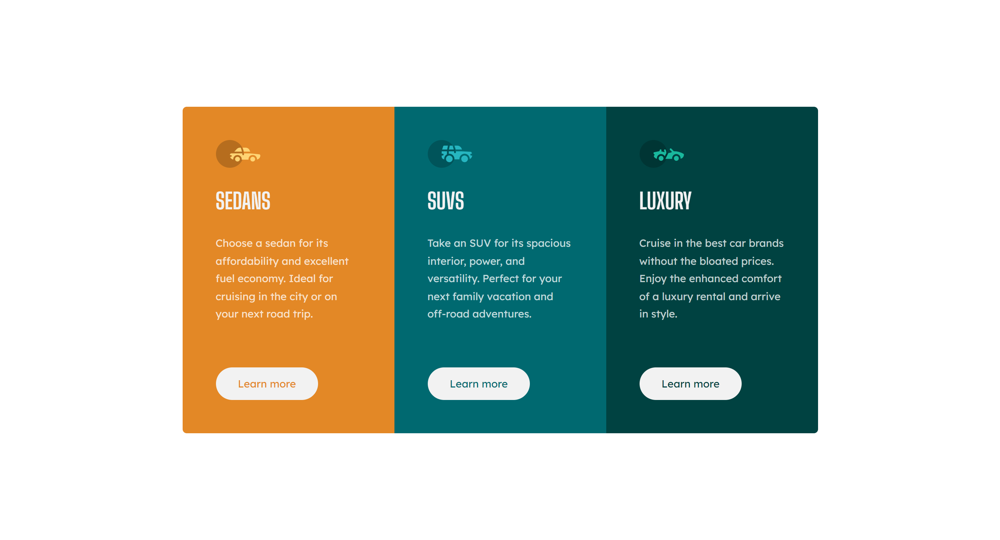
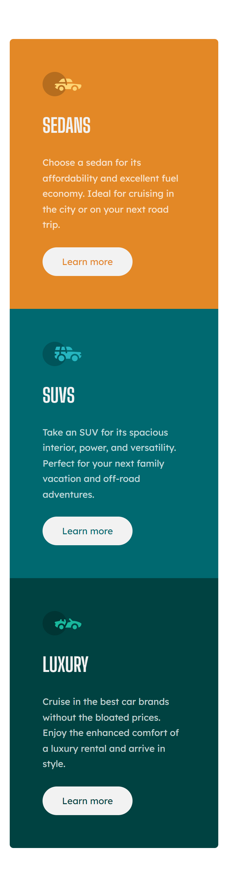

# Frontend Mentor - 3-column preview card component solution

This is a solution to the [3-column preview card component challenge on Frontend Mentor](https://www.frontendmentor.io/challenges/3column-preview-card-component-pH92eAR2-). Frontend Mentor challenges help you improve your coding skills by building realistic projects.

## Table of contents

-   [Overview](#overview)
    -   [The challenge](#the-challenge)
    -   [Screenshot](#screenshot)
    -   [Links](#links)
-   [My process](#my-process)
    -   [Built with](#built-with)
    -   [What I learned](#what-i-learned)
-   [Author](#author)

## Overview

### The challenge

Users should be able to:

-   View the optimal layout depending on their device's screen size
-   See hover states for interactive elements

### Screenshot

### Links

-   [Solution URL](https://github.com/TerminalEagle/3-column-preview-card-component-main)
-   [Live Site URL](https://whimsical-madeleine-57ade2.netlify.app/)

## My process

### Built with

-   Semantic HTML5 markup
-   CSS custom properties
-   Flexbox
-   Mobile-first workflow

### What I learned

Flexbox properties were something that I wasn't able to practically use them. This project helped me in getting one of these right, the `flex` property.

I used this property in aligning the button to the end without using grid.
The paragraph grows to eat the available space even when the content is short for the height, thereby preventing the undesired button placement otherwise.

## Author

-   Frontend Mentor - [@TerminalEagle](https://www.frontendmentor.io/profile/TerminalEagle)
